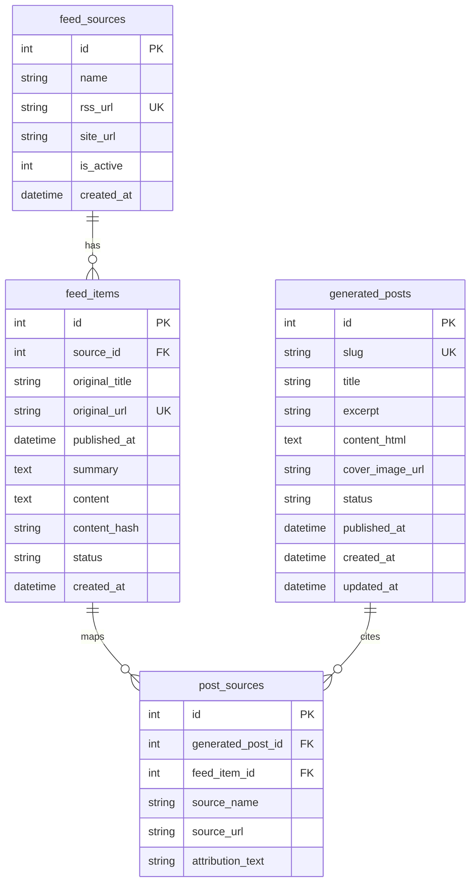

# Blog Data Schema

현재 블로그 자동화는 SQLAlchemy 모델 [models/blog_models.py](models/blog_models.py)를 기준으로 4개 테이블을 사용합니다.

## ERD

## 테이블
### `feed_sources`
RSS/Atom 소스 목록입니다.

| Column | Type | Notes |
| --- | --- | --- |
| `id` | Integer | Primary key |
| `name` | String(120) | 소스 표시명 |
| `rss_url` | String(500) | Unique, RSS/Atom URL |
| `site_url` | String(500) | 원 사이트 URL |
| `is_active` | Integer | 1이면 수집 대상 |
| `created_at` | DateTime | 생성 시각 |

### `feed_items`
RSS에서 수집한 원문 후보입니다.

| Column | Type | Notes |
| --- | --- | --- |
| `id` | Integer | Primary key |
| `source_id` | Integer | `feed_sources.id` |
| `original_title` | String(255) | 원문 제목 |
| `original_url` | String(500) | Unique, 원문 URL 또는 RSS URL |
| `published_at` | DateTime | 원문 발행 시각 |
| `summary` | Text | RSS 요약 |
| `content` | Text | RSS 본문 일부 |
| `content_hash` | String(64) | 중복 감지용 |
| `status` | String(20) | `new`, `used` 등 |
| `created_at` | DateTime | 수집 시각 |

### `generated_posts`
사이트에 표시되는 블로그 글입니다.

| Column | Type | Notes |
| --- | --- | --- |
| `id` | Integer | Primary key |
| `slug` | String(180) | Unique, `/blog/<slug>` 경로 |
| `title` | String(255) | 글 제목 |
| `excerpt` | String(500) | 목록/메타 요약 |
| `content_html` | Text | 렌더링할 HTML 본문 |
| `cover_image_url` | String(500) | 대표 이미지 URL |
| `status` | String(20) | `needs_review`, `draft`, `published` |
| `published_at` | DateTime | 공개 시각 |
| `created_at` | DateTime | 생성 시각 |
| `updated_at` | DateTime | 수정 시각 |

상태 의미:
- `needs_review`: 자동 생성 실패, 품질 기준 미달, 원문 URL 해석 실패 등으로 공개 불가
- `draft`: 검수 기준을 통과한 공개 후보
- `published`: 공개 페이지와 sitemap에 포함 가능한 글

### `post_sources`
생성 글과 원문 RSS item의 연결 테이블입니다.

| Column | Type | Notes |
| --- | --- | --- |
| `id` | Integer | Primary key |
| `generated_post_id` | Integer | `generated_posts.id` |
| `feed_item_id` | Integer | `feed_items.id` |
| `source_name` | String(120) | 출처명 |
| `source_url` | String(500) | 실제 원문 URL |
| `attribution_text` | String(255) | 내부 표식 제거 대상. 공개 글에서는 보통 `NULL` |

## 공개 기준과 스키마 관계
- `generated_posts.status = "published"`인 글만 `/blog/<slug>`에서 공개됩니다.
- `/blog/drafts`는 `draft`와 `needs_review`를 함께 보여주지만 비밀번호 세션이 필요합니다.
- `draft` 공개 시 `scripts.adsense_blog_review.audit_post(..., require_cover_image=True)`를 통과해야 합니다.
- 대표 이미지가 없거나, HTML 제외 본문이 3,000자 미만이거나, AgeCalc 내부 링크/출처가 없으면 공개되지 않습니다.
- 공개 글이 `BLOG_INDEX_MIN_POSTS` 기본값 3개 미만이면 `/blog`와 sitemap의 블로그 노출이 제한됩니다.

## SQLAlchemy 생성
테이블은 앱 시작 또는 스크립트 실행 시 `db.init_db()` / `Base.metadata.create_all()` 경로로 생성됩니다. 수동 SQL을 관리하기보다 [models/blog_models.py](models/blog_models.py)를 기준으로 확인하세요.
