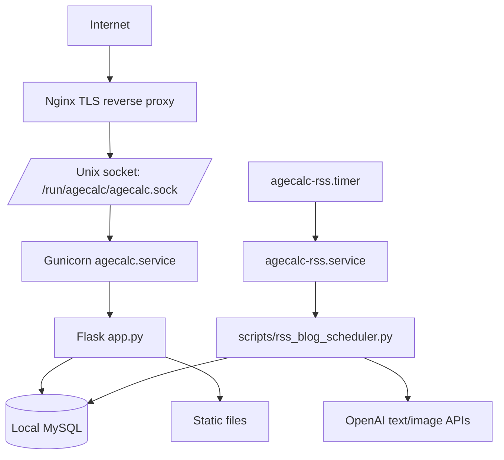

# AgeCalc 배포 가이드

AWS EC2 Ubuntu, Nginx, Gunicorn, MySQL, systemd 기준의 운영 문서입니다. 현재 production 구성은 `/srv/apps/agecalc` 경로와 `agecalc` 전용 계정을 기준으로 합니다.

## 1. 배포 구조


## 2. 서버 준비
### EC2 권장값
- OS: Ubuntu LTS
- Instance: `t3a.small` 이상 권장
- Inbound: `22`는 관리자 IP만, `80`/`443`은 전체
- MySQL을 같은 서버에서만 쓰면 `3306`은 외부에 열지 않습니다.

### 기본 패키지
```bash
ssh -i <KEY.pem> ubuntu@<EC2_PUBLIC_IP>
sudo apt-get update
sudo apt-get install -y nginx git curl htop bzip2 tar ca-certificates
```

## 3. 앱 계정과 코드 배치
```bash
sudo adduser --disabled-password --gecos "" agecalc
sudo mkdir -p /srv/apps
sudo chown -R agecalc:agecalc /srv/apps
cd /srv/apps
git clone <REPO_URL> agecalc
sudo chown -R agecalc:agecalc /srv/apps/agecalc
```

코드 수정과 앱 내부 스크립트 실행은 `agecalc` 계정에서 합니다.

```bash
sudo -iu agecalc
cd /srv/apps/agecalc
```

서비스 재시작, Nginx reload, systemd 설정 반영은 `ubuntu` 계정에서 `sudo`로 실행합니다.

## 4. Python 런타임
### micromamba 설치
```bash
curl -L https://micro.mamba.pm/api/micromamba/linux-64/latest \
  | sudo tar -xvj -C /usr/local/bin --strip-components=1 bin/micromamba
```

### 환경 생성
```bash
sudo -iu agecalc
cd /srv/apps/agecalc
micromamba create -y -p /srv/apps/agecalc/.micromamba/envs/agecalc -f environment.yml
/srv/apps/agecalc/.micromamba/envs/agecalc/bin/pip install -r requirements.txt
exit
```

## 5. MySQL
### 설치
```bash
sudo apt update
sudo apt install -y mysql-server
sudo systemctl enable mysql
sudo systemctl start mysql
sudo systemctl status mysql
```

### DB와 계정
```bash
sudo mysql
```

```sql
CREATE DATABASE IF NOT EXISTS agecalc
  CHARACTER SET utf8mb4
  COLLATE utf8mb4_unicode_ci;

CREATE USER IF NOT EXISTS 'agecalc_user'@'localhost'
  IDENTIFIED BY 'CHANGE_ME_STRONG_PASSWORD';

GRANT SELECT, INSERT, UPDATE, DELETE, CREATE, ALTER, INDEX
  ON agecalc.* TO 'agecalc_user'@'localhost';

FLUSH PRIVILEGES;
EXIT;
```

연결 확인:
```bash
mysql -u agecalc_user -p -h 127.0.0.1 -D agecalc -e "SELECT NOW() AS now_time;"
```

## 6. 환경 변수
운영 환경 변수는 `/srv/apps/agecalc/.env.rss`에 둡니다. 이 파일은 앱 서비스와 RSS 스케줄러가 같이 읽습니다.

```bash
sudo -iu agecalc
cd /srv/apps/agecalc
cp .env.rss.example .env.rss
chmod 600 .env.rss
```

필수 또는 권장 값:
- `DATABASE_URL`: MySQL 연결 문자열
- `OPENAI_API_KEY`: OpenAI 글/이미지 생성
- `OPENAI_MODEL`: 기본값 `gpt-4.1-mini`
- `OPENAI_IMAGE_MODEL`: 기본값 `gpt-image-1`
- `BLOG_BASE_URL`: 기본값 `https://agecalc.cloud`
- `BLOG_REVIEW_TOKEN`: 토큰 기반 검토 링크
- `BLOG_DRAFT_PASSWORD`: `/blog/drafts` 접근 비밀번호
- `SMTP_*`: draft 생성 알림 메일
- `FLASK_SECRET_KEY`: Flask 세션 서명 키

민감 정보는 저장소에 커밋하지 않습니다.

## 7. Gunicorn systemd 서비스
현재 앱은 `agecalc.service`로 실행합니다.

`/etc/systemd/system/agecalc.service`
```ini
[Unit]
Description=Gunicorn (agecalc, micromamba)
After=network.target

[Service]
User=agecalc
Group=www-data
WorkingDirectory=/srv/apps/agecalc
Environment="PATH=/srv/apps/agecalc/.micromamba/envs/agecalc/bin"
EnvironmentFile=/srv/apps/agecalc/.env.rss
RuntimeDirectory=agecalc
RuntimeDirectoryMode=0755
ExecStart=/srv/apps/agecalc/.micromamba/envs/agecalc/bin/gunicorn app:app \
  --bind unix:/run/agecalc/agecalc.sock \
  --workers 2 --threads 2 --timeout 30 --keep-alive 5 \
  --max-requests 1000 --max-requests-jitter 200
Restart=always

[Install]
WantedBy=multi-user.target
```

적용:
```bash
sudo systemctl daemon-reload
sudo systemctl enable --now agecalc.service
sudo systemctl status agecalc.service --no-pager
```

코드 변경 반영:
```bash
sudo systemctl restart agecalc.service
```

## 8. Nginx와 SSL
프로젝트의 `nginx/agecalc.conf`를 서버 설정으로 반영합니다.

```bash
sudo cp /srv/apps/agecalc/nginx/agecalc.conf /etc/nginx/conf.d/agecalc.conf
sudo nginx -t
sudo systemctl reload nginx
```

Let's Encrypt:
```bash
sudo snap install core
sudo snap refresh core
sudo snap install --classic certbot
sudo ln -s /snap/bin/certbot /usr/bin/certbot
sudo certbot --nginx -d agecalc.cloud -d www.agecalc.cloud
```

확인:
```bash
curl --unix-socket /run/agecalc/agecalc.sock http://localhost/health
curl -I https://agecalc.cloud/health
```

## 9. RSS 블로그 스케줄러
### 현재 production 스케줄
`agecalc-rss.timer`는 매일 `09:00`, `12:00`, `19:00` KST에 실행됩니다. `agecalc-rss.service`는 실행당 초안 1개 생성을 시도합니다.

현재 production 실행 명령:
```bash
/srv/apps/agecalc/.micromamba/envs/agecalc/bin/python \
  /srv/apps/agecalc/scripts/rss_blog_scheduler.py run \
  --limit 1 --status draft --provider openai --model gpt-4.1-mini
```

### RSS 소스 등록
```bash
sudo -iu agecalc
cd /srv/apps/agecalc
/srv/apps/agecalc/.micromamba/envs/agecalc/bin/python scripts/rss_blog_scheduler.py import-sources --file scripts/rss_sources.example.json
/srv/apps/agecalc/.micromamba/envs/agecalc/bin/python scripts/rss_blog_scheduler.py list-sources
exit
```

### 1회 실행
```bash
sudo -iu agecalc
cd /srv/apps/agecalc
/srv/apps/agecalc/.micromamba/envs/agecalc/bin/python scripts/rss_blog_scheduler.py run --limit 1 --status draft --provider openai --model gpt-4.1-mini
exit
```

### systemd timer 등록
```bash
sudo cp /srv/apps/agecalc/systemd/agecalc-rss.service /etc/systemd/system/agecalc-rss.service
sudo cp /srv/apps/agecalc/systemd/agecalc-rss.timer /etc/systemd/system/agecalc-rss.timer
sudo systemctl daemon-reload
sudo systemctl enable --now agecalc-rss.timer
sudo systemctl status agecalc-rss.timer --no-pager
```

수동 트리거와 로그:
```bash
sudo systemctl start agecalc-rss.service
sudo journalctl -u agecalc-rss.service -n 200 --no-pager
```

## 10. 블로그 공개 기준
OpenAI가 생성하더라도 아래 기준을 통과하지 못하면 `draft`가 아니라 `needs_review`로 남습니다.

- HTML 제외 본문 최소 `3,000자`
- 목표 본문 길이 `3,000~3,800자`
- `h2`/`h3` 소제목 5개 이상
- 실제 원문 URL 사용. Google News RSS 리디렉션 URL만 남으면 차단
- AgeCalc 내부 계산기 링크 1개 이상
- 대표 이미지 필요
- 내부 자동 생성 문구, 짧은 요약문, 번역체/복제성 제목 차단

초안 검토:
```text
https://agecalc.cloud/blog/drafts
```

공개 버튼은 `draft` 글에만 보입니다. `needs_review` 글은 재작성 또는 수동 보정 후 `draft`로 전환해야 합니다.

## 11. 배포 후 검증
- `/health` 응답 `200`
- `/sitemap.xml` 응답 정상
- 핵심 계산기 페이지 정상
- `/about`, `/contact`, `/references`, `/privacy`, `/terms` 접근 가능
- `/blog`는 공개 글 3개 미만이면 `X-Robots-Tag: noindex, nofollow`
- `/blog/<slug>`는 `published` 글만 접근 가능
- `/blog/drafts`는 비밀번호 세션 필요
- `/static/generated/blog-covers/` 이미지 파일 로드 가능

DB 테이블 확인:
```bash
mysql -u agecalc_user -p -h 127.0.0.1 -D agecalc -e "SHOW TABLES;"
```

예상 테이블:
- `feed_sources`
- `feed_items`
- `generated_posts`
- `post_sources`

## 12. 문제 해결
- MySQL 접속 실패: `sudo systemctl status mysql`, `ss -lntp | grep 3306`, `DATABASE_URL` 확인
- Gunicorn 미기동: `sudo journalctl -u agecalc.service -n 200 --no-pager`
- Nginx 502: `/run/agecalc/agecalc.sock` 존재 여부와 `sudo nginx -t` 확인
- RSS 생성 실패: `sudo journalctl -u agecalc-rss.service -n 200 --no-pager`
- OpenAI 생성 결과가 짧음: `needs_review`로 저장되는 것이 정상입니다. `scripts/rewrite_blog_posts.py`로 재작성하거나 프롬프트/토큰 설정을 조정합니다.
- draft 공개 실패: `/blog/drafts/<slug>`의 오류 메시지에서 본문 길이, 대표 이미지, 출처, 내부 링크 누락 여부를 확인합니다.

## 13. 운영 체크리스트
- [ ] DNS가 `agecalc.cloud`와 `www.agecalc.cloud`에 연결됨
- [ ] SSL 인증서 발급 완료
- [ ] `agecalc.service` 정상 실행
- [ ] `agecalc-rss.timer` 활성화
- [ ] MySQL 연결/권한 확인
- [ ] `.env.rss` 권한 `600`
- [ ] 블로그 공개 전 draft 검수
- [ ] sitemap과 robots.txt 확인
- [ ] 로그 모니터링 확인
