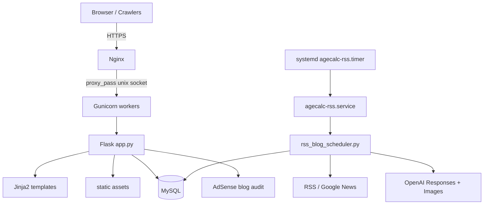
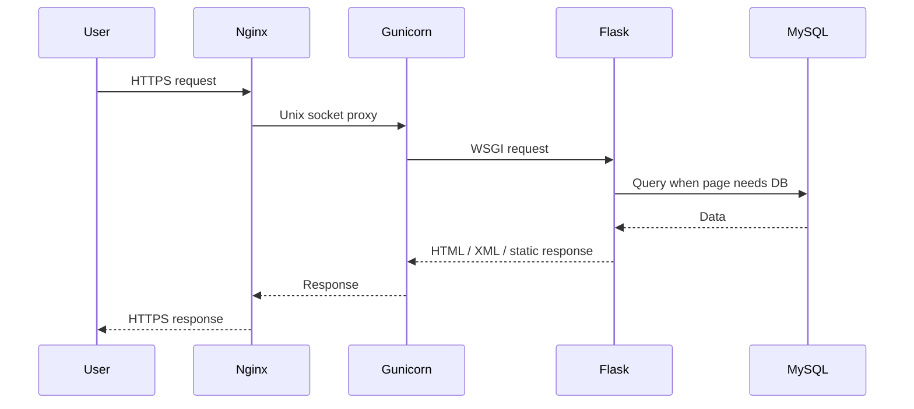

# AgeCalc Architecture

AgeCalc는 Flask 단일 앱을 중심으로 계산기, 안내 페이지, 미니게임, 블로그를 제공하고, 별도 systemd timer가 RSS 기반 블로그 초안을 생성합니다.

## Runtime

원본 Mermaid 파일: [docs/diagrams/runtime-architecture.mmd](diagrams/runtime-architecture.mmd)

## Request Flow

## Main Modules
| Path | Role |
| --- | --- |
| `app.py` | Flask routes, navigation, sitemap, blog public/draft/review gates |
| `models/blog_models.py` | RSS source/item, generated post, source mapping ORM models |
| `scripts/rss_blog_scheduler.py` | RSS ingest, OpenAI generation, image generation, draft creation |
| `scripts/rewrite_blog_posts.py` | 기존 블로그 글을 상태별로 재작성하고 검수 통과 시 `draft` 또는 `published`로 전환 |
| `scripts/adsense_blog_review.py` | 공개 전 품질/정책 리스크 검사 |
| `templates/` | Jinja2 page templates |
| `static/` | CSS, JS, favicon, generated cover images |
| `systemd/` | 앱/RSS 스케줄러 systemd template |
| `nginx/agecalc.conf` | production Nginx reverse proxy config |

## Public Indexing Rules
- 계산기/안내 페이지는 sitemap에 포함됩니다.
- 미니게임은 애드센스 승인 안정성을 위해 sitemap에서 제외되고 noindex 대상으로 관리됩니다.
- 블로그 목록과 상세는 공개 글이 `BLOG_INDEX_MIN_POSTS` 기본값 3개 이상일 때 sitemap에 포함됩니다.
- `draft`와 `needs_review`는 public route에서 접근되지 않습니다.
